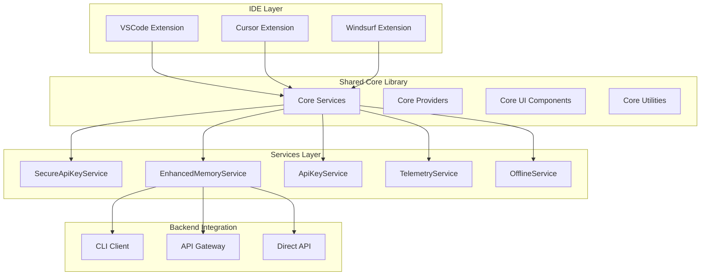
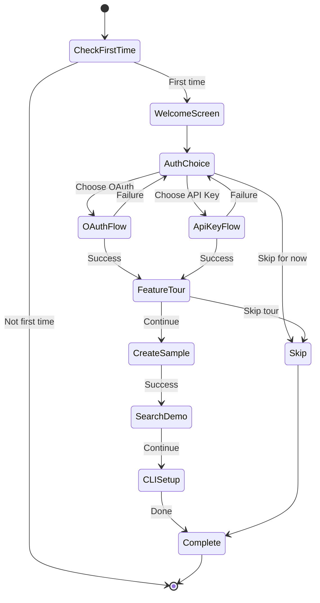

# Design Document: IDE Extension UX Enhancement

## Overview

This design document outlines the technical architecture and implementation strategy for enhancing the Lanonasis Memory Assistant IDE extensions (VSCode, Cursor, and Windsurf) to meet enterprise-grade standards for developer tools. The enhancement focuses on creating a unified, accessible, and performant user experience across all IDE variants while maintaining security and reliability.

### Goals

1. **Unified Experience**: Create consistent UI/UX across VSCode, Cursor, and Windsurf extensions
2. **Enhanced Onboarding**: Implement interactive tutorials and guided first-time user experiences
3. **Improved Performance**: Optimize loading times, implement caching, and leverage CLI integration
4. **Accessibility**: Ensure WCAG 2.1 AA compliance for all UI components
5. **Security**: Standardize secure credential storage across all IDE variants
6. **Developer Experience**: Provide contextual help, better error messages, and diagnostic tools

### Current State Analysis

**Strengths:**

- VSCode extension has robust SecureApiKeyService with OAuth2+PKCE
- EnhancedMemoryService provides CLI integration with fallback to API
- Comprehensive command palette integration
- Good separation of concerns (services, providers, panels)

**Gaps Identified:**

- Cursor and Windsurf use less secure authentication (local HTTP server, config storage)
- Inconsistent branding (Windsurf references "Cursor" in UI)
- No unified onboarding flow across IDEs
- Limited accessibility features (no ARIA labels, focus indicators)
- No offline capability or operation queueing
- Windsurf doesn't use EnhancedMemoryService by default
- No telemetry or usage analytics
- Limited contextual help system

## Architecture

### High-Level Architecture



### Component Architecture

#### 1. Shared Core Library

**Purpose**: Eliminate code duplication and ensure consistency across IDE variants

**Structure**:

```
packages/ide-extension-core/
├── src/
│   ├── services/
│   │   ├── SecureApiKeyService.ts      # Unified secure auth
│   │   ├── EnhancedMemoryService.ts    # Memory operations with CLI
│   │   ├── ApiKeyService.ts            # API key management
│   │   ├── TelemetryService.ts         # Privacy-focused analytics
│   │   ├── OfflineService.ts           # Offline queue & cache
│   │   └── OnboardingService.ts        # Tutorial & first-time UX
│   ├── providers/
│   │   ├── MemoryTreeProvider.ts       # Tree view for memories
│   │   ├── MemoryCompletionProvider.ts # Code completion
│   │   └── ApiKeyTreeProvider.ts       # API key tree view
│   ├── ui/
│   │   ├── components/                 # Reusable UI components
│   │   ├── webview/                    # Webview templates
│   │   └── styles/                     # Shared styles
│   ├── utils/
│   │   ├── diagnostics.ts              # System health checks
│   │   ├── errorRecovery.ts            # Error handling utilities
│   │   ├── accessibility.ts            # A11y helpers
│   │   └── validation.ts               # Zod schemas
│   └── types/
│       └── memory-aligned.ts           # Shared type definitions
└── package.json
```

**Key Design Decisions**:

- Use TypeScript for type safety across all IDEs
- Export IDE-agnostic interfaces that each variant implements
- Provide factory functions for IDE-specific instantiation
- Use dependency injection for testability

#### 2. IDE-Specific Adapters

Each IDE extension will be a thin adapter layer:

```typescript
// VSCode adapter example
import { createExtension } from "@lanonasis/ide-extension-core";
import * as vscode from "vscode";

export function activate(context: vscode.ExtensionContext) {
  const extension = createExtension({
    ide: "vscode",
    context,
    secretStorage: context.secrets,
    outputChannel: vscode.window.createOutputChannel("Lanonasis"),
    branding: {
      name: "VSCode",
      displayName: "Visual Studio Code",
    },
  });

  return extension.activate();
}
```

## Components and Interfaces

### 1. Unified Secure Authentication Service

**Purpose**: Provide consistent, secure authentication across all IDE variants

**Interface**:

```typescript
interface ISecureAuthService {
  // Initialization
  initialize(): Promise<void>;

  // Authentication methods
  authenticateWithOAuth(options?: OAuthOptions): Promise<string | null>;
  authenticateWithApiKey(): Promise<string | null>;
  promptForAuthentication(): Promise<string | null>;

  // Token management
  getApiKey(): Promise<string | null>;
  getAuthenticationHeader(): Promise<string | null>;
  hasApiKey(): Promise<boolean>;
  deleteApiKey(): Promise<void>;
  refreshToken(): Promise<void>;

  // Migration
  migrateFromLegacyStorage(): Promise<void>;
}

interface OAuthOptions {
  authUrl?: string;
  clientId?: string;
  scopes?: string[];
  pkce?: boolean; // Always true, but configurable for testing
}
```

**Implementation Details**:

1. **OAuth2 with PKCE Flow**:
   - Generate code verifier and challenge using crypto
   - Start local HTTP server on configurable port (default: 8080)
   - Open browser with authorization URL
   - Handle callback with state validation
   - Exchange code for token with PKCE verifier
   - Store tokens in IDE's secure storage

2. **Secure Storage Strategy**:
   - VSCode: Use `context.secrets` API (OS keychain)
   - Cursor: Implement equivalent using Electron's safeStorage
   - Windsurf: Implement equivalent using platform-specific keychain

3. **Token Refresh**:
   - Check token expiration before each API call
   - Automatically refresh if within 5 minutes of expiry
   - Queue requests during refresh to avoid race conditions

4. **Migration Path**:
   - Check for legacy API keys in configuration
   - Prompt user to migrate to secure storage
   - Optionally clear legacy configuration after migration

### 2. Enhanced Onboarding System

**Purpose**: Guide new users through setup and feature discovery

**Interface**:

```typescript
interface IOnboardingService {
  // State management
  isFirstTime(): Promise<boolean>;
  markOnboardingComplete(): Promise<void>;
  resetOnboarding(): Promise<void>;

  // Tutorial steps
  showWelcomeScreen(): Promise<void>;
  showAuthenticationGuide(): Promise<AuthenticationResult>;
  showFeatureTour(): Promise<void>;
  createSampleMemory(): Promise<void>;

  // Progress tracking
  getOnboardingProgress(): Promise<OnboardingProgress>;
  markStepComplete(step: OnboardingStep): Promise<void>;
}

interface OnboardingProgress {
  completed: boolean;
  steps: {
    welcome: boolean;
    authentication: boolean;
    firstMemory: boolean;
    search: boolean;
    cliSetup: boolean;
  };
  skipped: boolean;
}

enum OnboardingStep {
  Welcome = "welcome",
  Authentication = "authentication",
  FirstMemory = "firstMemory",
  Search = "search",
  CLISetup = "cliSetup",
}
```

**Onboarding Flow**:



**Welcome Screen Design**:

- Hero section with product value proposition
- Visual demonstration (animated GIF or video)
- Clear authentication options with explanations
- "Skip for now" option with easy restart access
- Links to documentation and support

**Feature Tour**:

- Interactive walkthrough of key features
- Highlight keyboard shortcuts
- Show sidebar, tree view, and command palette
- Demonstrate memory creation and search
- Explain CLI integration benefits

### 3. Modern Sidebar Interface

**Purpose**: Provide intuitive, accessible UI for memory management

**Component Structure**:

```typescript
interface ISidebarProvider {
  // Lifecycle
  resolveWebviewView(webviewView: WebviewView): void;
  refresh(): Promise<void>;
  dispose(): void;

  // State management
  updateState(state: Partial<SidebarState>): void;
  getState(): SidebarState;

  // Actions
  handleSearch(query: string): Promise<void>;
  handleCreateMemory(): Promise<void>;
  handleOpenMemory(memoryId: string): Promise<void>;
}

interface SidebarState {
  authenticated: boolean;
  loading: boolean;
  memories: MemoryEntry[];
  searchResults: MemorySearchResult[];
  searchQuery: string;
  selectedMemory: MemoryEntry | null;
  enhancedMode: boolean;
  cliVersion: string | null;
  error: string | null;
}
```

**UI Layout**:

```
┌─────────────────────────────────────┐
│ 🧠 Lanonasis Memory                 │
├─────────────────────────────────────┤
│ [Search memories...]          [⚙️]  │
├─────────────────────────────────────┤
│ ▼ Context (12)                      │
│   📝 API Authentication Flow        │
│   📝 Database Schema Design         │
│   📝 Error Handling Pattern         │
│                                     │
│ ▼ Project (8)                       │
│   📁 Project Setup Guide            │
│   📁 Architecture Decisions         │
│                                     │
│ ▼ Knowledge (15)                    │
│   💡 React Hooks Best Practices    │
│   💡 TypeScript Generics            │
│                                     │
│ [+ Create Memory]                   │
├─────────────────────────────────────┤
│ 🚀 CLI Mode Active                  │
└─────────────────────────────────────┘
```

**Accessibility Features**:

- ARIA labels for all interactive elements
- Keyboard navigation with visible focus indicators
- Screen reader announcements for dynamic updates
- High contrast mode support
- Minimum 4.5:1 contrast ratio for all text
- Semantic HTML structure

**Responsive Design**:

- Adapt to sidebar width changes
- Collapsible sections for space efficiency
- Virtual scrolling for large lists
- Progressive loading with skeleton screens

### 4. Offline Capability Service

**Purpose**: Enable basic functionality when network is unavailable

**Interface**:

```typescript
interface IOfflineService {
  // Network status
  isOnline(): boolean;
  onNetworkChange(callback: (online: boolean) => void): Disposable;

  // Cache management
  cacheMemory(memory: MemoryEntry): Promise<void>;
  getCachedMemory(id: string): Promise<MemoryEntry | null>;
  getCachedMemories(): Promise<MemoryEntry[]>;
  clearCache(): Promise<void>;

  // Operation queue
  queueOperation(operation: QueuedOperation): Promise<void>;
  getPendingOperations(): Promise<QueuedOperation[]>;
  syncPendingOperations(): Promise<SyncResult>;

  // Search cache
  cacheSearchResults(
    query: string,
    results: MemorySearchResult[]
  ): Promise<void>;
  getCachedSearchResults(query: string): Promise<MemorySearchResult[] | null>;
}

interface QueuedOperation {
  id: string;
  type: "create" | "update" | "delete";
  timestamp: number;
  data: any;
  retryCount: number;
  status: "pending" | "syncing" | "failed";
}

interface SyncResult {
  successful: number;
  failed: number;
  errors: Array<{ operation: QueuedOperation; error: string }>;
}
```

**Implementation Strategy**:

1. **Network Detection**:
   - Use navigator.onLine for initial state
   - Listen to online/offline events
   - Implement heartbeat check to API endpoint
   - Show offline indicator in status bar

2. **Caching Strategy**:
   - Use IndexedDB for persistent storage
   - Cache recently accessed memories (last 50)
   - Cache search results for 5 minutes
   - Implement LRU eviction policy

3. **Operation Queue**:
   - Store operations in IndexedDB
   - Retry with exponential backoff
   - Show sync status in UI
   - Allow manual retry for failed operations

4. **Conflict Resolution**:
   - Timestamp-based conflict detection
   - Prompt user for conflict resolution
   - Option to keep local, remote, or merge

### 5. Telemetry Service (Privacy-Focused)

**Purpose**: Collect anonymized usage data to improve the product

**Interface**:

```typescript
interface ITelemetryService {
  // Initialization
  initialize(config: TelemetryConfig): Promise<void>;

  // Opt-in/out
  isEnabled(): boolean;
  setEnabled(enabled: boolean): Promise<void>;

  // Event tracking
  trackEvent(event: TelemetryEvent): void;
  trackError(error: Error, context?: Record<string, any>): void;
  trackPerformance(metric: PerformanceMetric): void;

  // Session management
  startSession(): void;
  endSession(): void;

  // Data export (GDPR compliance)
  exportUserData(): Promise<TelemetryData>;
  deleteUserData(): Promise<void>;
}

interface TelemetryEvent {
  name: string;
  category: "authentication" | "memory" | "search" | "ui" | "performance";
  properties?: Record<string, string | number | boolean>;
  timestamp?: number;
}

interface PerformanceMetric {
  name: string;
  duration: number;
  metadata?: Record<string, any>;
}

interface TelemetryConfig {
  enabled: boolean;
  endpoint?: string;
  batchSize?: number;
  flushInterval?: number;
  anonymizeIp?: boolean;
}
```

**Privacy Principles**:

- Opt-in by default (not opt-out)
- No PII collection (no code content, memory content, or user identifiers)
- Anonymized session IDs
- Clear privacy policy
- Easy opt-out mechanism
- GDPR-compliant data export and deletion

**Events to Track**:

- Authentication method chosen (OAuth vs API key)
- Memory operations (create, search, delete) - counts only
- Feature usage (commands executed)
- Error occurrences (type and frequency)
- Performance metrics (load times, search latency)
- CLI vs API usage ratio
- Extension activation/deactivation

**Data Retention**:

- 90 days for event data
- 30 days for error logs
- Aggregate statistics retained indefinitely

### 6. Enhanced Diagnostics System

**Purpose**: Provide comprehensive system health checks and troubleshooting

**Interface**:

```typescript
interface IDiagnosticsService {
  // Health checks
  runFullDiagnostics(): Promise<DiagnosticReport>;
  checkAuthentication(): Promise<DiagnosticResult>;
  checkNetworkConnectivity(): Promise<DiagnosticResult>;
  checkCLIAvailability(): Promise<DiagnosticResult>;
  checkAPIEndpoint(): Promise<DiagnosticResult>;

  // Reporting
  generateReport(results: DiagnosticResult[]): string;
  exportReport(format: "markdown" | "json" | "html"): Promise<string>;

  // Auto-fix
  suggestFixes(result: DiagnosticResult): Fix[];
  applyFix(fix: Fix): Promise<boolean>;
}

interface DiagnosticReport {
  timestamp: number;
  overall: "healthy" | "degraded" | "critical";
  results: DiagnosticResult[];
  recommendations: string[];
}

interface DiagnosticResult {
  category: string;
  name: string;
  status: "pass" | "warn" | "fail";
  message: string;
  details?: Record<string, any>;
  fixes?: Fix[];
}

interface Fix {
  id: string;
  description: string;
  automatic: boolean;
  action: () => Promise<void>;
}
```

**Diagnostic Checks**:

1. **Authentication**:
   - API key present in secure storage
   - Token not expired
   - Token has required scopes
   - OAuth refresh token available

2. **Network**:
   - Internet connectivity
   - API endpoint reachable
   - Gateway endpoint reachable
   - DNS resolution working
   - Firewall/proxy not blocking

3. **CLI Integration**:
   - CLI installed and in PATH
   - CLI version compatible (>= 3.0.6)
   - CLI authenticated
   - MCP support available

4. **Configuration**:
   - Required settings present
   - Settings values valid
   - No conflicting settings
   - Workspace trust enabled

5. **Performance**:
   - Extension activation time
   - Memory usage
   - API response times
   - Cache hit rate

**Auto-Fix Capabilities**:

- Re-authenticate if token expired
- Clear cache if corrupted
- Reset settings to defaults
- Install/update CLI
- Configure proxy settings

## Data Models

### Memory Entry Schema

```typescript
import { z } from "zod";

export const MemoryTypeSchema = z.enum([
  "context",
  "project",
  "knowledge",
  "reference",
  "personal",
  "workflow",
  "conversation",
]);

export const MemoryEntrySchema = z.object({
  id: z.string().uuid(),
  user_id: z.string().uuid(),
  title: z.string().min(1).max(255),
  content: z.string().min(1),
  memory_type: MemoryTypeSchema,
  tags: z.array(z.string()).default([]),
  metadata: z.record(z.any()).default({}),
  created_at: z.string().datetime(),
  updated_at: z.string().datetime(),
  status: z.enum(["active", "archived", "deleted"]).default("active"),
});

export const CreateMemoryRequestSchema = MemoryEntrySchema.omit({
  id: true,
  user_id: true,
  created_at: true,
  updated_at: true,
});

export const SearchMemoryRequestSchema = z.object({
  query: z.string().min(1),
  limit: z.number().int().min(1).max(100).default(20),
  threshold: z.number().min(0).max(1).default(0.7),
  memory_types: z.array(MemoryTypeSchema).optional(),
  tags: z.array(z.string()).optional(),
  status: z.enum(["active", "archived", "deleted"]).default("active"),
});

export type MemoryType = z.infer<typeof MemoryTypeSchema>;
export type MemoryEntry = z.infer<typeof MemoryEntrySchema>;
export type CreateMemoryRequest = z.infer<typeof CreateMemoryRequestSchema>;
export type SearchMemoryRequest = z.infer<typeof SearchMemoryRequestSchema>;
```

### Configuration Schema

```typescript
export const ExtensionConfigSchema = z.object({
  // API Configuration
  apiUrl: z.string().url().default("https://api.lanonasis.com"),
  gatewayUrl: z.string().url().default("https://api.lanonasis.com"),
  authUrl: z.string().url().default("https://auth.lanonasis.com"),
  useGateway: z.boolean().default(true),

  // Memory Settings
  defaultMemoryType: MemoryTypeSchema.default("context"),
  searchLimit: z.number().int().min(1).max(50).default(10),
  enableAutoCompletion: z.boolean().default(true),

  // CLI Integration
  preferCLI: z.boolean().default(true),
  enableMCP: z.boolean().default(true),
  cliDetectionTimeout: z.number().int().min(500).max(10000).default(2000),

  // UI Preferences
  showTreeView: z.boolean().default(false),
  showPerformanceFeedback: z.boolean().default(false),
  enableLegacyViews: z.boolean().default(false),

  // API Key Management
  enableApiKeyManagement: z.boolean().default(true),
  defaultEnvironment: z
    .enum(["development", "staging", "production"])
    .default("development"),
  organizationId: z.string().optional(),

  // Telemetry
  enableTelemetry: z.boolean().default(false),

  // Advanced
  verboseLogging: z.boolean().default(false),
});

export type ExtensionConfig = z.infer<typeof ExtensionConfigSchema>;
```

## Error Handling

### Error Classification

```typescript
export enum ErrorSeverity {
  Info = "info",
  Warning = "warning",
  Error = "error",
  Critical = "critical",
}

export enum ErrorCategory {
  Authentication = "authentication",
  Network = "network",
  Validation = "validation",
  Permission = "permission",
  RateLimit = "rate_limit",
  Server = "server",
  Unknown = "unknown",
}

export interface ExtensionError {
  code: string;
  message: string;
  category: ErrorCategory;
  severity: ErrorSeverity;
  recoverable: boolean;
  userMessage: string;
  technicalDetails?: string;
  suggestedActions: string[];
  documentationUrl?: string;
}
```

### Error Recovery Strategies

**1. Authentication Errors**:

```typescript
const authErrorHandler = {
  "401": {
    message: "Your session has expired",
    actions: ["Re-authenticate", "Use API Key"],
    recovery: async () => {
      await secureAuthService.refreshToken();
      // Retry original operation
    },
  },
  "403": {
    message: "You don't have permission for this operation",
    actions: ["Check API Key Permissions", "Contact Support"],
    recovery: null, // Manual intervention required
  },
};
```

**2. Network Errors**:

```typescript
const networkErrorHandler = {
  ECONNREFUSED: {
    message: "Cannot connect to Lanonasis API",
    actions: ["Check Internet Connection", "Verify API URL", "Check Firewall"],
    recovery: async () => {
      // Queue operation for offline sync
      await offlineService.queueOperation(operation);
    },
  },
  ETIMEDOUT: {
    message: "Request timed out",
    actions: ["Retry", "Check Network Speed"],
    recovery: async () => {
      // Retry with exponential backoff
      await retryWithBackoff(operation, { maxRetries: 3 });
    },
  },
};
```

**3. Validation Errors**:

```typescript
const validationErrorHandler = {
  INVALID_MEMORY_TYPE: {
    message: "Invalid memory type selected",
    actions: ["Choose Valid Type"],
    recovery: async () => {
      // Show type picker
      const type = await showMemoryTypePicker();
      return type;
    },
  },
};
```

### Retry Logic

```typescript
interface RetryOptions {
  maxRetries: number;
  initialDelay: number;
  maxDelay: number;
  backoffMultiplier: number;
  retryableErrors: string[];
}

async function retryWithBackoff<T>(
  operation: () => Promise<T>,
  options: Partial<RetryOptions> = {}
): Promise<T> {
  const config: RetryOptions = {
    maxRetries: 3,
    initialDelay: 1000,
    maxDelay: 10000,
    backoffMultiplier: 2,
    retryableErrors: ["ETIMEDOUT", "ECONNREFUSED", "503", "429"],
    ...options,
  };

  let lastError: Error;
  let delay = config.initialDelay;

  for (let attempt = 0; attempt <= config.maxRetries; attempt++) {
    try {
      return await operation();
    } catch (error) {
      lastError = error as Error;

      // Check if error is retryable
      const isRetryable = config.retryableErrors.some(
        (code) => error.message.includes(code) || error.code === code
      );

      if (!isRetryable || attempt === config.maxRetries) {
        throw error;
      }

      // Wait before retry
      await new Promise((resolve) => setTimeout(resolve, delay));
      delay = Math.min(delay * config.backoffMultiplier, config.maxDelay);
    }
  }

  throw lastError!;
}
```

## Testing Strategy

### Unit Testing

**Framework**: Jest with TypeScript support

**Coverage Targets**:

- Services: 90% coverage
- Providers: 80% coverage
- Utilities: 95% coverage
- UI Components: 70% coverage

**Test Structure**:

```typescript
describe("SecureApiKeyService", () => {
  let service: SecureApiKeyService;
  let mockContext: MockExtensionContext;
  let mockOutputChannel: MockOutputChannel;

  beforeEach(() => {
    mockContext = createMockContext();
    mockOutputChannel = createMockOutputChannel();
    service = new SecureApiKeyService(mockContext, mockOutputChannel);
  });

  describe("OAuth Flow", () => {
    it("should generate valid PKCE parameters", () => {
      const verifier = service["generateCodeVerifier"]();
      const challenge = service["generateCodeChallenge"](verifier);

      expect(verifier).toHaveLength(43); // Base64URL encoded 32 bytes
      expect(challenge).toHaveLength(43);
    });

    it("should handle OAuth callback with valid state", async () => {
      const result = await service.authenticateWithOAuth();
      expect(result).toBeTruthy();
      expect(mockContext.secrets.store).toHaveBeenCalled();
    });

    it("should reject OAuth callback with invalid state", async () => {
      // Test implementation
    });
  });

  describe("Token Management", () => {
    it("should refresh expired tokens automatically", async () => {
      // Test implementation
    });

    it("should queue requests during token refresh", async () => {
      // Test implementation
    });
  });
});
```

### Integration Testing

**Framework**: VSCode Extension Test Runner

**Test Scenarios**:

1. Extension activation and initialization
2. Authentication flow end-to-end
3. Memory CRUD operations
4. Search functionality
5. CLI integration detection
6. Offline mode and sync
7. Settings persistence

**Example**:

```typescript
suite("Extension Integration Tests", () => {
  test("Should activate extension successfully", async () => {
    const ext = vscode.extensions.getExtension("LanOnasis.lanonasis-memory");
    await ext?.activate();

    assert.ok(ext?.isActive);
  });

  test("Should authenticate and create memory", async () => {
    // Authenticate
    await vscode.commands.executeCommand("lanonasis.authenticate", "apikey");

    // Create memory
    const editor = await vscode.window.showTextDocument(/* ... */);
    editor.selection = new vscode.Selection(0, 0, 5, 0);

    await vscode.commands.executeCommand("lanonasis.createMemory");

    // Verify memory created
    const memories = await memoryService.listMemories();
    assert.ok(memories.length > 0);
  });
});
```

### E2E Testing

**Framework**: Playwright for webview testing

**Test Scenarios**:

1. Complete onboarding flow
2. Memory creation from UI
3. Search with filters
4. Settings configuration
5. Error recovery flows
6. Accessibility compliance

### Accessibility Testing

**Tools**:

- axe-core for automated a11y testing
- Manual keyboard navigation testing
- Screen reader testing (NVDA, JAWS, VoiceOver)

**Checklist**:

- [ ] All interactive elements keyboard accessible
- [ ] Focus indicators visible
- [ ] ARIA labels present
- [ ] Color contrast meets WCAG AA
- [ ] Screen reader announcements work
- [ ] No keyboard traps
- [ ] Logical tab order

## Performance Optimization

### Loading Performance

**Target Metrics**:

- Extension activation: < 500ms
- Sidebar render: < 300ms
- Memory list load: < 1s (for 100 items)
- Search results: < 1s

**Optimization Strategies**:

1. **Lazy Loading**:

```typescript
// Load heavy dependencies only when needed
let enhancedMemoryClient: typeof import("@lanonasis/memory-client") | null =
  null;

async function getMemoryClient() {
  if (!enhancedMemoryClient) {
    enhancedMemoryClient = await import("@lanonasis/memory-client");
  }
  return enhancedMemoryClient;
}
```

2. **Code Splitting**:

```typescript
// Separate webview bundle from extension bundle
// webpack.config.js
module.exports = {
  entry: {
    extension: "./src/extension.ts",
    webview: "./src/webview/index.ts",
  },
  output: {
    path: path.resolve(__dirname, "out"),
    filename: "[name].js",
  },
};
```

3. **Virtual Scrolling**:

```typescript
// Only render visible items in memory list
interface VirtualListProps {
    items: MemoryEntry[];
    itemHeight: number;
    containerHeight: number;
}

function VirtualList({ items, itemHeight, containerHeight }: VirtualListProps) {
    const [scrollTop, setScrollTop] = useState(0);

    const startIndex = Math.floor(scrollTop / itemHeight);
    const endIndex = Math.ceil((scrollTop + containerHeight) / itemHeight);
    const visibleItems = items.slice(startIndex, endIndex);

    return (
        <div onScroll={(e) => setScrollTop(e.currentTarget.scrollTop)}>
            <div style={{ height: items.length * itemHeight }}>
                <div style={{ transform: `translateY(${startIndex * itemHeight}px)` }}>
                    {visibleItems.map(item => <MemoryItem key={item.id} memory={item} />)}
                </div>
            </div>
        </div>
    );
}
```

### Caching Strategy

**Multi-Level Cache**:

1. **Memory Cache** (in-memory, fast):

```typescript
class MemoryCache {
  private cache = new Map<string, { data: any; expires: number }>();
  private maxSize = 100;

  set(key: string, data: any, ttl: number = 300000) {
    if (this.cache.size >= this.maxSize) {
      const firstKey = this.cache.keys().next().value;
      this.cache.delete(firstKey);
    }

    this.cache.set(key, {
      data,
      expires: Date.now() + ttl,
    });
  }

  get(key: string): any | null {
    const entry = this.cache.get(key);
    if (!entry) return null;

    if (Date.now() > entry.expires) {
      this.cache.delete(key);
      return null;
    }

    return entry.data;
  }
}
```

2. **IndexedDB Cache** (persistent, slower):

```typescript
class PersistentCache {
  private db: IDBDatabase;

  async set(key: string, data: any): Promise<void> {
    const tx = this.db.transaction(["cache"], "readwrite");
    const store = tx.objectStore("cache");
    await store.put({ key, data, timestamp: Date.now() });
  }

  async get(key: string): Promise<any | null> {
    const tx = this.db.transaction(["cache"], "readonly");
    const store = tx.objectStore("cache");
    const result = await store.get(key);
    return result?.data || null;
  }
}
```

### Bundle Size Optimization

**Current Size**: ~141KB (VSCode extension)
**Target Size**: <100KB

**Strategies**:

- Tree-shaking unused code
- Minification with terser
- Compression (gzip)
- Remove development dependencies from bundle
- Use dynamic imports for optional features

```javascript
// webpack.config.js
module.exports = {
  optimization: {
    minimize: true,
    minimizer: [
      new TerserPlugin({
        terserOptions: {
          compress: {
            drop_console: true,
            drop_debugger: true,
          },
        },
      }),
    ],
    usedExports: true,
    sideEffects: false,
  },
};
```

## Security Considerations

### Threat Model

**Assets to Protect**:

1. User API keys and OAuth tokens
2. Memory content (potentially sensitive code)
3. User identity and session data
4. Extension configuration

**Threats**:

1. **Credential Theft**: Malicious extensions or processes accessing stored credentials
2. **Man-in-the-Middle**: Network interception of API requests
3. **XSS in Webview**: Malicious content injection in sidebar
4. **Local Storage Exposure**: Credentials stored in plaintext
5. **Token Replay**: Stolen tokens used for unauthorized access

### Security Measures

**1. Secure Credential Storage**:

```typescript
// Use OS-level secure storage
// macOS: Keychain
// Windows: Credential Manager
// Linux: Secret Service API

class SecureStorage {
  async store(key: string, value: string): Promise<void> {
    // VSCode SecretStorage API uses OS keychain
    await this.context.secrets.store(key, value);
  }

  async retrieve(key: string): Promise<string | undefined> {
    return await this.context.secrets.get(key);
  }

  async delete(key: string): Promise<void> {
    await this.context.secrets.delete(key);
  }
}
```

**2. Content Security Policy**:

```typescript
const csp = [
  "default-src 'none'",
  `script-src 'nonce-${nonce}' 'unsafe-eval'`, // unsafe-eval needed for some frameworks
  `style-src ${webview.cspSource} 'unsafe-inline'`, // unsafe-inline for dynamic styles
  `img-src ${webview.cspSource} https: data:`,
  `font-src ${webview.cspSource}`,
  "connect-src https://api.lanonasis.com https://auth.lanonasis.com",
].join("; ");
```

**3. Input Sanitization**:

```typescript
function sanitizeHtml(html: string): string {
  return html
    .replace(/&/g, "&amp;")
    .replace(/</g, "&lt;")
    .replace(/>/g, "&gt;")
    .replace(/"/g, "&quot;")
    .replace(/'/g, "&#039;");
}

function sanitizeMemoryContent(content: string): string {
  // Remove potential script tags
  return content.replace(
    /<script\b[^<]*(?:(?!<\/script>)<[^<]*)*<\/script>/gi,
    ""
  );
}
```

**4. API Request Security**:

```typescript
class SecureApiClient {
  async request(endpoint: string, options: RequestOptions): Promise<Response> {
    // Always use HTTPS
    const url = new URL(endpoint, "https://api.lanonasis.com");

    // Add authentication header
    const authHeader = await this.authService.getAuthenticationHeader();

    // Set security headers
    const headers = {
      ...options.headers,
      Authorization: authHeader,
      "User-Agent": `Lanonasis-VSCode/${version}`,
      "X-Client-Version": version,
      "X-Request-ID": generateRequestId(),
    };

    // Validate SSL certificate
    return fetch(url.toString(), {
      ...options,
      headers,
      // Reject self-signed certificates
      agent: new https.Agent({ rejectUnauthorized: true }),
    });
  }
}
```

**5. Token Expiration and Refresh**:

```typescript
interface TokenData {
  access_token: string;
  refresh_token?: string;
  expires_at: number;
}

class TokenManager {
  async getValidToken(): Promise<string> {
    const tokenData = await this.getStoredToken();

    // Check if token is expired or will expire soon (5 min buffer)
    if (Date.now() >= tokenData.expires_at - 300000) {
      return await this.refreshToken(tokenData.refresh_token);
    }

    return tokenData.access_token;
  }

  async refreshToken(refreshToken: string): Promise<string> {
    // Implement token refresh logic
    const newToken = await this.authService.refreshAccessToken(refreshToken);
    await this.storeToken(newToken);
    return newToken.access_token;
  }
}
```

### Audit Logging

```typescript
interface AuditLog {
  timestamp: number;
  event: string;
  userId?: string;
  success: boolean;
  details?: Record<string, any>;
}

class AuditLogger {
  log(event: string, success: boolean, details?: Record<string, any>): void {
    const log: AuditLog = {
      timestamp: Date.now(),
      event,
      success,
      details: this.sanitizeDetails(details),
    };

    // Log to output channel (no sensitive data)
    this.outputChannel.appendLine(JSON.stringify(log));
  }

  private sanitizeDetails(details?: Record<string, any>): Record<string, any> {
    if (!details) return {};

    // Remove sensitive fields
    const sanitized = { ...details };
    delete sanitized.apiKey;
    delete sanitized.token;
    delete sanitized.password;

    return sanitized;
  }
}
```

## Migration Strategy

### Phase 1: Create Shared Core Library

**Timeline**: 2 weeks

**Tasks**:

1. Create `@lanonasis/ide-extension-core` package
2. Extract common services from VSCode extension
3. Create IDE-agnostic interfaces
4. Implement factory pattern for IDE-specific instantiation
5. Add comprehensive unit tests
6. Document API and usage patterns

**Deliverables**:

- Shared core package published to npm
- API documentation
- Migration guide for existing extensions

### Phase 2: Migrate VSCode Extension

**Timeline**: 2 weeks

**Tasks**:

1. Refactor VSCode extension to use shared core
2. Implement new onboarding flow
3. Add offline capability
4. Implement telemetry service
5. Enhance diagnostics system
6. Update UI with accessibility improvements
7. Add comprehensive tests

**Deliverables**:

- Updated VSCode extension (v2.0.0)
- Migration guide for users
- Updated documentation

### Phase 3: Migrate Cursor Extension

**Timeline**: 1.5 weeks

**Tasks**:

1. Replace authentication with SecureApiKeyService
2. Adopt EnhancedMemoryService by default
3. Fix branding issues
4. Implement shared UI components
5. Add missing features (offline, telemetry, diagnostics)
6. Update tests

**Deliverables**:

- Updated Cursor extension (v2.0.0)
- Feature parity with VSCode

### Phase 4: Migrate Windsurf Extension

**Timeline**: 1.5 weeks

**Tasks**:

1. Replace authentication with SecureApiKeyService
2. Adopt EnhancedMemoryService by default
3. Fix branding issues (remove Cursor references)
4. Implement shared UI components
5. Add missing features
6. Update tests

**Deliverables**:

- Updated Windsurf extension (v2.0.0)
- Feature parity with VSCode and Cursor

### Phase 5: Polish and Release

**Timeline**: 1 week

**Tasks**:

1. Cross-IDE testing
2. Performance optimization
3. Accessibility audit
4. Security review
5. Documentation updates
6. Release notes
7. Marketing materials

**Deliverables**:

- All three extensions released as v2.0.0
- Comprehensive documentation
- Migration guides
- Blog post announcing updates

### Backward Compatibility

**Breaking Changes**:

- Minimum VSCode version: 1.74.0
- Minimum CLI version: 3.0.6
- Configuration migration required

**Migration Path**:

1. Detect legacy configuration on first activation
2. Prompt user to migrate
3. Automatically migrate API keys to secure storage
4. Preserve user settings where possible
5. Show migration success message

**Rollback Plan**:

- Keep v1.x available for download
- Provide downgrade instructions
- Monitor error rates post-release
- Quick-fix releases for critical issues

## Deployment and Release

### Build Pipeline

```yaml
# .github/workflows/build-extensions.yml
name: Build Extensions

on:
  push:
    branches: [main, develop]
  pull_request:
    branches: [main]

jobs:
  build-core:
    runs-on: ubuntu-latest
    steps:
      - uses: actions/checkout@v3
      - uses: actions/setup-node@v3
        with:
          node-version: "18"
      - name: Install dependencies
        run: npm ci
        working-directory: packages/ide-extension-core
      - name: Run tests
        run: npm test
        working-directory: packages/ide-extension-core
      - name: Build
        run: npm run build
        working-directory: packages/ide-extension-core
      - name: Upload artifact
        uses: actions/upload-artifact@v3
        with:
          name: core-package
          path: packages/ide-extension-core/dist

  build-vscode:
    needs: build-core
    runs-on: ubuntu-latest
    steps:
      - uses: actions/checkout@v3
      - uses: actions/setup-node@v3
      - name: Download core package
        uses: actions/download-artifact@v3
        with:
          name: core-package
      - name: Install dependencies
        run: npm ci
        working-directory: apps/lanonasis-maas/IDE-EXTENSIONS/vscode-extension
      - name: Run tests
        run: npm test
        working-directory: apps/lanonasis-maas/IDE-EXTENSIONS/vscode-extension
      - name: Package extension
        run: npm run package
        working-directory: apps/lanonasis-maas/IDE-EXTENSIONS/vscode-extension
      - name: Upload VSIX
        uses: actions/upload-artifact@v3
        with:
          name: vscode-extension
          path: apps/lanonasis-maas/IDE-EXTENSIONS/vscode-extension/*.vsix

  # Similar jobs for cursor and windsurf
```

### Release Process

**Version Numbering**: Semantic Versioning (MAJOR.MINOR.PATCH)

**Release Checklist**:

- [ ] All tests passing
- [ ] Documentation updated
- [ ] CHANGELOG.md updated
- [ ] Version bumped in package.json
- [ ] Git tag created
- [ ] Extensions packaged
- [ ] Marketplace submission (VSCode)
- [ ] GitHub release created
- [ ] Release notes published
- [ ] Social media announcement

**Marketplace Publishing**:

```bash
# VSCode Marketplace
cd apps/lanonasis-maas/IDE-EXTENSIONS/vscode-extension
vsce publish

# Cursor (manual distribution via GitHub releases)
# Windsurf (manual distribution via GitHub releases)
```

### Monitoring and Analytics

**Metrics to Track**:

1. **Installation Metrics**:
   - Total installs
   - Daily active users
   - Retention rate
   - Uninstall rate

2. **Performance Metrics**:
   - Extension activation time
   - Memory usage
   - API response times
   - Error rates

3. **Feature Usage**:
   - Authentication method preference
   - Memory operations per user
   - Search frequency
   - CLI vs API usage ratio

4. **User Satisfaction**:
   - Marketplace ratings
   - GitHub issues
   - Support tickets
   - User feedback

**Alerting**:

- Error rate > 5%
- Crash rate > 1%
- API latency > 2s
- Uninstall rate spike

## Documentation Plan

### User Documentation

**1. Getting Started Guide**:

- Installation instructions
- Authentication setup (OAuth vs API key)
- First memory creation
- Basic search
- Keyboard shortcuts

**2. Feature Guides**:

- Memory management
- Advanced search
- API key management
- CLI integration
- Offline mode
- Settings customization

**3. Troubleshooting**:

- Common issues and solutions
- Diagnostic tools
- Error messages explained
- Performance optimization tips
- FAQ

**4. Video Tutorials**:

- 2-minute quick start
- 5-minute feature overview
- 10-minute deep dive

### Developer Documentation

**1. Architecture Overview**:

- Component diagram
- Data flow
- Service layer
- Provider layer
- UI layer

**2. API Reference**:

- Service interfaces
- Provider interfaces
- Utility functions
- Type definitions

**3. Contributing Guide**:

- Development setup
- Code style
- Testing requirements
- Pull request process
- Release process

**4. Extension Development**:

- Creating custom providers
- Adding new commands
- Extending UI
- Plugin system (future)

### Internal Documentation

**1. Design Decisions**:

- Architecture choices
- Technology selection
- Trade-offs
- Future considerations

**2. Security Documentation**:

- Threat model
- Security measures
- Audit procedures
- Incident response

**3. Operations Runbook**:

- Deployment procedures
- Rollback procedures
- Monitoring setup
- Alert handling

## Success Metrics

### Key Performance Indicators (KPIs)

**Adoption Metrics**:

- Target: 10,000 installs in first 3 months
- Target: 70% retention after 30 days
- Target: 4+ star rating on marketplace

**Engagement Metrics**:

- Target: 50+ memories created per active user per month
- Target: 100+ searches per active user per month
- Target: 80% of users complete onboarding

**Performance Metrics**:

- Target: <500ms extension activation
- Target: <1s search response time
- Target: <2% error rate
- Target: 95% uptime

**Quality Metrics**:

- Target: 90% test coverage
- Target: 0 critical security vulnerabilities
- Target: WCAG 2.1 AA compliance
- Target: <5% uninstall rate

### Success Criteria

**Phase 1 Success** (Shared Core):

- [ ] Core package published
- [ ] 90%+ test coverage
- [ ] API documentation complete
- [ ] Zero breaking changes to existing extensions

**Phase 2 Success** (VSCode Migration):

- [ ] All requirements implemented
- [ ] Performance targets met
- [ ] Accessibility audit passed
- [ ] User testing completed with positive feedback

**Phase 3-4 Success** (Cursor/Windsurf Migration):

- [ ] Feature parity achieved
- [ ] Branding issues resolved
- [ ] Secure authentication implemented
- [ ] Cross-IDE consistency verified

**Phase 5 Success** (Release):

- [ ] All three extensions released
- [ ] Documentation complete
- [ ] Marketing materials published
- [ ] Positive community feedback

## Risks and Mitigation

### Technical Risks

**Risk**: Breaking changes in IDE APIs

- **Mitigation**: Pin to specific IDE versions, test against beta releases
- **Contingency**: Maintain compatibility layer

**Risk**: Performance degradation with large memory collections

- **Mitigation**: Implement pagination, virtual scrolling, aggressive caching
- **Contingency**: Add performance mode with reduced features

**Risk**: OAuth flow blocked by corporate firewalls

- **Mitigation**: Provide API key fallback, document proxy configuration
- **Contingency**: Support custom OAuth endpoints

### Product Risks

**Risk**: Low user adoption

- **Mitigation**: Strong onboarding, clear value proposition, marketing
- **Contingency**: Gather feedback, iterate quickly

**Risk**: High uninstall rate

- **Mitigation**: Monitor telemetry, quick bug fixes, user support
- **Contingency**: Rollback to stable version

**Risk**: Security vulnerability discovered

- **Mitigation**: Security audits, penetration testing, bug bounty
- **Contingency**: Emergency patch process, user notification

### Timeline Risks

**Risk**: Development delays

- **Mitigation**: Agile sprints, regular check-ins, buffer time
- **Contingency**: Reduce scope, phase releases

**Risk**: Testing bottlenecks

- **Mitigation**: Automated testing, parallel testing, early QA involvement
- **Contingency**: Extended testing phase

## Conclusion

This design provides a comprehensive blueprint for enhancing the Lanonasis Memory Assistant IDE extensions to meet enterprise-grade standards. The phased approach allows for incremental delivery while maintaining stability. The shared core library ensures consistency across IDE variants while reducing maintenance burden.

Key success factors:

1. **User-Centric Design**: Focus on onboarding and ease of use
2. **Security First**: Implement robust authentication and data protection
3. **Performance**: Optimize for speed and responsiveness
4. **Accessibility**: Ensure inclusive design for all users
5. **Consistency**: Maintain feature parity across all IDE variants

The implementation will follow the requirements document closely, with regular checkpoints to ensure alignment with user needs and business goals.
