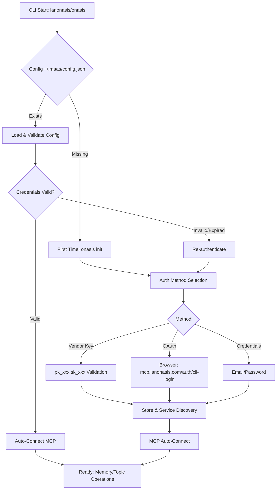
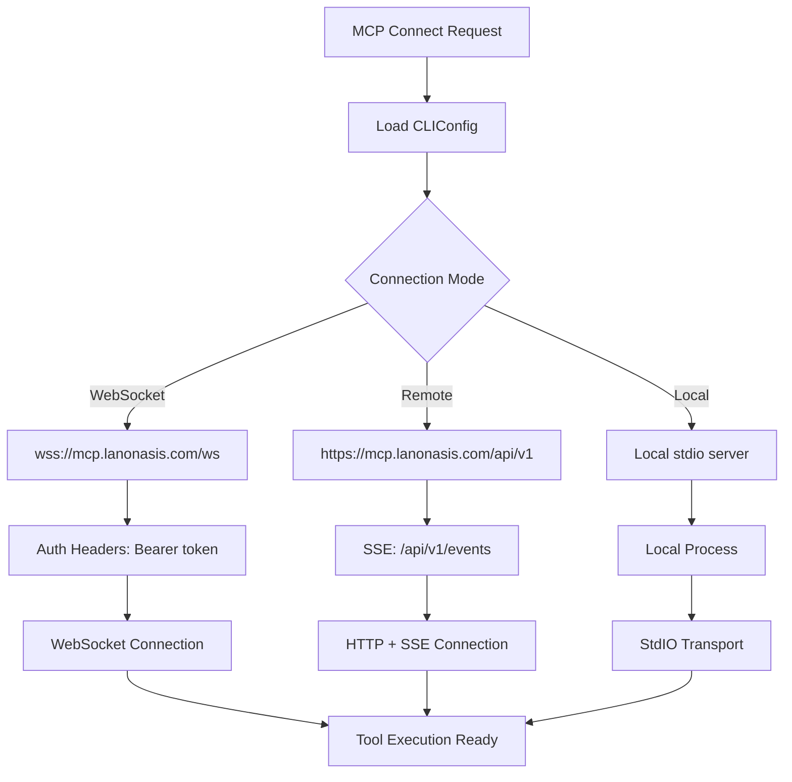

# Design Document - CLI Authentication Persistence Fix

## Overview

This design addresses critical authentication persistence and cross-device connectivity issues in the existing Lanonasis CLI (v3.0.13). The solution enhances the current CLIConfig class, improves the existing MCP client reliability, and fixes authentication validation issues while maintaining compatibility with the deployed infrastructure at api.lanonasis.com and mcp.lanonasis.com.

## Current Architecture Analysis

The CLI already has:
- **Dual command support**: `lanonasis` and `onasis` aliases
- **MCP integration**: Enhanced MCP client with WebSocket, HTTP, and SSE support
- **Service discovery**: Uses `/.well-known/onasis.json` for endpoint discovery
- **Authentication methods**: Vendor key, JWT, and OAuth flows
- **Configuration management**: CLIConfig class with ~/.maas/config.json storage

## Architecture Enhancements

### Enhanced Authentication Flow



### Current MCP Connection Flow (Enhanced)



## Components and Interfaces

### 1. Enhanced CLIConfig Class (Existing Enhancement)

**File**: `cli/src/utils/config.ts` (enhance existing)

```typescript
// Add to existing CLIConfigData interface
interface CLIConfigData {
  // Existing fields...
  
  // Enhanced authentication persistence
  authMethod?: 'vendor_key' | 'jwt' | 'oauth';
  tokenExpiry?: number;
  lastValidated?: string;
  deviceId?: string;
  
  // Enhanced MCP configuration
  mcpConnectionMode?: 'local' | 'remote' | 'websocket';
  mcpWebSocketUrl?: string;
  mcpRetryAttempts?: number;
  mcpHealthCheckInterval?: number;
}

// Add to existing CLIConfig class
class CLIConfig {
  // New methods to add
  async validateStoredCredentials(): Promise<boolean>
  async refreshTokenIfNeeded(): Promise<void>
  async atomicSave(): Promise<void>
  async getDeviceId(): Promise<string>
  async validateVendorKeyFormat(key: string): boolean
  async clearInvalidCredentials(): Promise<void>
}
```

### 2. Enhanced MCP Client (Existing Enhancement)

**File**: `cli/src/utils/mcp-client.ts` (enhance existing)

```typescript
// Add to existing MCPClient class
class MCPClient {
  // New properties
  private retryAttempts: number = 0;
  private maxRetries: number = 3;
  private healthCheckInterval?: NodeJS.Timeout;
  
  // Enhanced methods
  async connectWithRetry(options: MCPConnectionOptions): Promise<boolean>
  async validateAuthBeforeConnect(): Promise<void>
  async handleConnectionFailure(error: Error): Promise<void>
  async startHealthMonitoring(): Promise<void>
  async stopHealthMonitoring(): Promise<void>
  private async exponentialBackoff(attempt: number): Promise<void>
}
```

### 3. Authentication Validator Service

**File**: `cli/src/services/auth-validator.ts` (new)

```typescript
class AuthValidator {
  private config: CLIConfig;
  
  async validateVendorKey(key: string): Promise<ValidationResult>
  async validateJWTToken(token: string): Promise<ValidationResult>
  async testAPIConnectivity(): Promise<boolean>
  async refreshExpiredToken(): Promise<string | null>
  async clearInvalidAuth(): Promise<void>
}

interface ValidationResult {
  valid: boolean;
  expired?: boolean;
  error?: string;
  expiresAt?: Date;
}
```

### 4. Enhanced MCP Server (Existing Enhancement)

**File**: `cli/src/mcp/server/lanonasis-server.ts` (enhance existing)

The existing MCP server already supports multiple transports. Enhancements needed:

```typescript
// Add to existing server
class LanonasisMCPServer {
  // Enhanced connection handling
  private connectionHealth: Map<string, ConnectionHealth>;
  
  async validateClientAuth(headers: Record<string, string>): Promise<boolean>
  async handleMultipleConnections(): Promise<void>
  async monitorConnectionHealth(): Promise<void>
  async gracefulShutdown(): Promise<void>
}

interface ConnectionHealth {
  clientId: string;
  lastPing: Date;
  transport: 'websocket' | 'stdio' | 'http';
  authenticated: boolean;
}
```

## Data Models

### Enhanced Configuration Model (extends existing)

```typescript
// Enhance existing CLIConfigData
interface CLIConfigData {
  // Existing fields maintained...
  apiUrl?: string;
  token?: string;
  user?: UserProfile;
  lastUpdated?: string;
  vendorKey?: string;
  authMethod?: 'jwt' | 'vendor_key' | 'oauth';
  discoveredServices?: ServiceEndpoints;
  
  // New fields for persistence fix
  tokenExpiry?: number;
  lastValidated?: string;
  deviceId?: string;
  authFailureCount?: number;
  lastAuthFailure?: string;
  
  // Enhanced MCP config
  mcpConnectionMode?: 'local' | 'remote' | 'websocket';
  mcpWebSocketUrl?: string;
  mcpRetryAttempts?: number;
  mcpLastHealthCheck?: string;
}
```

### Connection Status Model

```typescript
interface MCPConnectionStatus {
  connected: boolean;
  mode: 'local' | 'remote' | 'websocket';
  server?: string;
  lastConnected?: Date;
  failureCount: number;
  lastError?: string;
  latency?: number;
}
```

### Authentication Validation Model

```typescript
interface AuthValidationResult {
  isValid: boolean;
  method: 'vendor_key' | 'jwt' | 'oauth';
  expiresAt?: Date;
  needsRefresh: boolean;
  error?: {
    code: string;
    message: string;
    recoverable: boolean;
  };
}
```

## Error Handling

### Authentication Error Recovery (enhance existing auth.ts)

```typescript
// Add to existing loginCommand in cli/src/commands/auth.ts
async function handleAuthenticationFailure(error: any, config: CLIConfig): Promise<void> {
  // Increment failure count
  const failureCount = (config.get('authFailureCount') || 0) + 1;
  await config.setAndSave('authFailureCount', failureCount);
  await config.setAndSave('lastAuthFailure', new Date().toISOString());
  
  // Clear invalid credentials
  if (error.response?.status === 401) {
    await config.clearInvalidCredentials();
  }
  
  // Provide specific guidance
  if (failureCount >= 3) {
    console.log(chalk.yellow('Multiple authentication failures detected.'));
    console.log(chalk.cyan('Try: lanonasis auth logout && lanonasis auth login'));
  }
}
```

### MCP Connection Error Recovery (enhance existing mcp-client.ts)

```typescript
// Add to existing MCPClient class
class MCPClient {
  private async handleConnectionError(error: Error, options: MCPConnectionOptions): Promise<void> {
    this.retryAttempts++;
    
    if (this.retryAttempts >= this.maxRetries) {
      console.error(chalk.red(`Failed to connect after ${this.maxRetries} attempts`));
      
      // Provide specific troubleshooting
      if (error.message.includes('ECONNREFUSED')) {
        console.log(chalk.yellow('Connection refused. Check if the service is running:'));
        console.log(chalk.cyan('• For remote: Check https://mcp.lanonasis.com/health'));
        console.log(chalk.cyan('• For local: Install local MCP server'));
      } else if (error.message.includes('401') || error.message.includes('403')) {
        console.log(chalk.yellow('Authentication failed. Try:'));
        console.log(chalk.cyan('• lanonasis auth status'));
        console.log(chalk.cyan('• lanonasis auth login --vendor-key pk_xxx.sk_xxx'));
      }
      
      throw error;
    }
    
    // Exponential backoff
    const delay = Math.min(1000 * Math.pow(2, this.retryAttempts), 10000);
    console.log(chalk.yellow(`Retrying in ${delay}ms... (${this.retryAttempts}/${this.maxRetries})`));
    await new Promise(resolve => setTimeout(resolve, delay));
  }
}
```

### Service Discovery Error Recovery (enhance existing config.ts)

```typescript
// Add to existing CLIConfig class
async discoverServicesWithFallback(): Promise<void> {
  try {
    await this.discoverServices();
  } catch (error) {
    console.log(chalk.yellow('Service discovery failed, using cached/fallback endpoints'));
    
    // Use last known good endpoints or hardcoded fallbacks
    if (!this.config.discoveredServices) {
      this.config.discoveredServices = {
        auth_base: 'https://api.lanonasis.com',
        memory_base: 'https://api.lanonasis.com/api/v1',
        mcp_base: 'https://mcp.lanonasis.com/api/v1',
        mcp_ws_base: 'wss://mcp.lanonasis.com/ws',
        mcp_sse_base: 'https://mcp.lanonasis.com/api/v1/events',
        project_scope: 'lanonasis-maas'
      };
      await this.save();
    }
  }
}
```

## Testing Strategy

### Authentication Testing

1. **Credential Persistence Tests**
   - Verify vendor key storage and retrieval
   - Test JWT token expiration handling
   - Validate cross-session authentication

2. **Cross-Device Testing**
   - Test same credentials on multiple devices
   - Verify service discovery consistency
   - Test configuration synchronization

3. **Error Scenario Testing**
   - Invalid credential handling
   - Network failure recovery
   - Service discovery failures

### MCP Connection Testing

1. **Transport Protocol Tests**
   - WebSocket connection reliability
   - HTTP fallback functionality
   - SSE streaming capabilities

2. **Failover Testing**
   - Server unavailability scenarios
   - Network interruption recovery
   - Multi-server failover logic

3. **IDE Integration Tests**
   - Multiple IDE connections
   - Concurrent tool execution
   - Transport protocol switching

### Performance Testing

1. **Connection Performance**
   - Connection establishment time
   - Tool execution latency
   - Memory usage monitoring

2. **Reliability Testing**
   - Long-running connection stability
   - Recovery from network issues
   - Resource cleanup verification

## Security Considerations

### Credential Storage Security

- Encrypt sensitive credentials at rest
- Use secure key derivation for encryption
- Implement secure credential rotation
- Clear credentials on logout

### MCP Server Security

- Authenticate all incoming connections
- Implement rate limiting per connection
- Validate all tool arguments
- Audit tool execution logs

### Network Security

- Use TLS for all network communications
- Validate SSL certificates
- Implement request signing for API calls
- Use secure WebSocket connections (WSS)

## Implementation Notes

### Compatibility with Existing Infrastructure

This design maintains full compatibility with the deployed system:

1. **Preserve existing commands**: `lanonasis` and `onasis` aliases continue to work
2. **Maintain API endpoints**: Uses existing api.lanonasis.com and mcp.lanonasis.com
3. **Keep configuration location**: ~/.maas/config.json remains the same
4. **Support existing auth methods**: Vendor key, JWT, and OAuth flows unchanged

### Service Discovery Integration

Leverage existing service discovery at `/.well-known/onasis.json`:

1. Use discovered endpoints as primary
2. Fall back to hardcoded endpoints if discovery fails
3. Cache discovered endpoints for offline use
4. Validate endpoint availability before use

### MCP Server Compatibility

Work with existing MCP server at `cli/src/mcp/server/lanonasis-server.ts`:

1. Enhance connection handling without breaking existing tools
2. Maintain compatibility with IDE integrations
3. Support existing transport protocols (WebSocket, HTTP, SSE)
4. Preserve tool registry and execution patterns

### Cross-Device Synchronization

Enable consistent experience across devices:

1. Use same vendor key format (pk_xxx.sk_xxx) everywhere
2. Validate credentials against same endpoints
3. Use consistent service discovery results
4. Maintain same configuration structure

### Deployment Considerations

Align with existing deployment at api.lanonasis.com:

1. No changes to server-side endpoints required
2. CLI updates are backward compatible
3. Existing users can upgrade seamlessly
4. No breaking changes to MCP protocol implementation