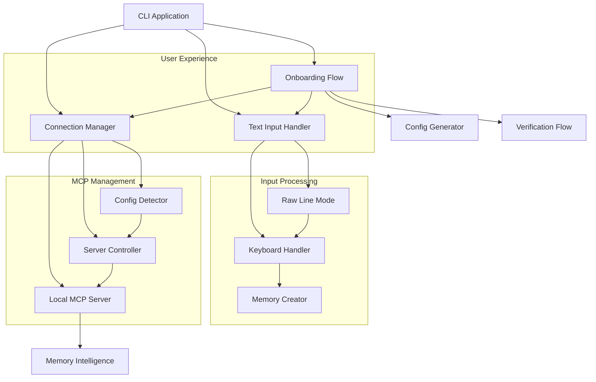

# Design Document: CLI UX Improvements

## Overview

This design addresses critical user experience issues in the CLI by replacing vim-based memory creation with seamless inline text input and fixing local MCP server connectivity. The solution focuses on creating a frictionless user experience from onboarding through daily usage while maintaining backward compatibility.

The core approach involves:

1. Implementing a custom multi-line text input handler that bypasses readline limitations
2. Automatically configuring and managing the embedded MCP server for local connections
3. Creating a smooth onboarding flow that sets up working defaults
4. Enhancing error handling and user feedback throughout the system

## Architecture



## Components and Interfaces

### Text Input Handler

**Purpose**: Provides seamless multi-line text input without external editors

**Key Methods**:

```typescript
interface TextInputHandler {
  collectMultilineInput(prompt: string, options?: InputOptions): Promise<string>;
  enableRawMode(): void;
  disableRawMode(): void;
  handleSpecialKeys(key: KeyEvent): boolean;
  displayInputPrompt(content: string): void;
}

interface InputOptions {
  placeholder?: string;
  maxLines?: number;
  submitKeys?: string[];
  cancelKeys?: string[];
  showLineNumbers?: boolean;
}
```

**Implementation Strategy**:

- Use `process.stdin.setRawMode(true)` to capture individual keystrokes
- Handle special characters manually (Ctrl+C, Enter, Backspace, Arrow keys)
- Provide visual feedback for multi-line editing with line numbers
- Support common editing shortcuts (Ctrl+A, Ctrl+E, Ctrl+U)

### Connection Manager

**Purpose**: Manages MCP server discovery, configuration, and connection lifecycle

**Key Methods**:

```typescript
interface ConnectionManager {
  connectLocal(): Promise<ConnectionResult>;
  autoConfigureLocalServer(): Promise<ConfigResult>;
  detectServerPath(): Promise<string | null>;
  startLocalServer(): Promise<ServerInstance>;
  verifyConnection(serverPath: string): Promise<boolean>;
  getConnectionStatus(): ConnectionStatus;
}

interface ConnectionResult {
  success: boolean;
  serverPath?: string;
  error?: string;
  suggestions?: string[];
}
```

**Implementation Strategy**:

- Automatically detect embedded MCP server location within CLI package
- Generate configuration files with correct server paths
- Start server processes automatically when needed
- Implement health checks and connection verification

### Onboarding Flow

**Purpose**: Guides new users through initial setup and configuration

**Key Methods**:

```typescript
interface OnboardingFlow {
  runInitialSetup(): Promise<SetupResult>;
  detectFirstRun(): boolean;
  configureDefaults(): Promise<void>;
  testConnectivity(): Promise<TestResult[]>;
  showWelcomeDemo(): Promise<void>;
}

interface SetupResult {
  completed: boolean;
  mcpConfigured: boolean;
  memorySystemReady: boolean;
  issues?: string[];
}
```

**Implementation Strategy**:

- Detect first-run scenarios by checking for configuration files
- Create working default configurations automatically
- Test all major functionality and report status
- Provide interactive demonstrations of key features

## Data Models

### Input Session

```typescript
interface InputSession {
  id: string;
  prompt: string;
  content: string[];
  cursorPosition: CursorPosition;
  startTime: Date;
  options: InputOptions;
  status: 'active' | 'completed' | 'cancelled';
}

interface CursorPosition {
  line: number;
  column: number;
}
```

### MCP Configuration

```typescript
interface MCPConfig {
  localServerPath: string;
  serverPort?: number;
  autoStart: boolean;
  connectionTimeout: number;
  retryAttempts: number;
  logLevel: 'error' | 'warn' | 'info' | 'debug';
}

interface ServerInstance {
  pid: number;
  port: number;
  status: 'starting' | 'running' | 'stopped' | 'error';
  startTime: Date;
  logPath: string;
}
```

### User Preferences

```typescript
interface UserPreferences {
  inputMode: 'inline' | 'editor';
  preferredEditor?: string;
  autoStartMCP: boolean;
  showOnboardingTips: boolean;
  verboseErrors: boolean;
}
```

## Correctness Properties

## Correctness Properties

_A property is a characteristic or behavior that should hold true across all valid executions of a system-essentially, a formal statement about what the system should do. Properties serve as the bridge between human-readable specifications and machine-verifiable correctness guarantees._

### Property Reflection

After analyzing all acceptance criteria, several properties can be consolidated to eliminate redundancy:

- Properties 1.1 and 1.2 both test multi-line input handling and can be combined into a comprehensive multi-line input property
- Properties 2.1, 2.2, and 2.4 all relate to local MCP server management and can be combined into a comprehensive local server management property
- Properties 3.1, 3.2, 3.3, 3.4, and 3.5 all test backward compatibility and can be combined into a comprehensive compatibility property
- Properties 5.1, 5.2, and 5.3 all test error message quality and can be combined into a comprehensive error handling property

### Core Properties

**Property 1: Multi-line Input Handling**
_For any_ memory creation session, the Text Input Handler should accept and process multi-line text input without opening external editors, providing visual feedback and proper completion/cancellation flows
**Validates: Requirements 1.1, 1.2, 1.3, 1.4, 1.5**

**Property 2: Local MCP Server Management**
_For any_ CLI session, the Connection Manager should automatically configure, start, and connect to the embedded Local MCP Server, verifying functionality and reporting connection status
**Validates: Requirements 2.1, 2.2, 2.3, 2.4**

**Property 3: Error Handling and User Feedback**
_For any_ error condition (memory creation, MCP connection, command usage, unexpected states), the system should provide specific error messages with suggested fixes while logging detailed information for debugging
**Validates: Requirements 2.5, 5.1, 5.2, 5.3, 5.4, 5.5**

**Property 4: Backward Compatibility**
_For any_ existing command, configuration, or user preference, the CLI should maintain current functionality and respect existing settings while providing new capabilities
**Validates: Requirements 3.1, 3.2, 3.3, 3.4, 3.5**

**Property 5: Onboarding and Setup**
_For any_ first-run scenario, the Onboarding Flow should guide users through setup, configure working defaults, test connectivity, and demonstrate key features with clear troubleshooting when issues arise
**Validates: Requirements 4.1, 4.2, 4.3, 4.4, 4.5**

**Property 6: Configuration Management**
_For any_ configuration state (missing, corrupted, or requiring customization), the CLI should automatically detect and configure working defaults, validate settings on startup, and provide clear options for customization
**Validates: Requirements 6.1, 6.2, 6.3, 6.4, 6.5**

## Error Handling

### Input Handling Errors

**Raw Mode Failures**: If `setRawMode(true)` fails, gracefully fall back to standard readline with clear explanation of limitations.

**Keyboard Event Processing**: Handle malformed or unexpected keyboard events without crashing, logging details for debugging.

**Memory Allocation**: For very large text inputs, implement streaming or chunking to prevent memory exhaustion.

### MCP Connection Errors

**Server Discovery Failures**: When embedded server path cannot be detected, provide manual configuration options with clear instructions.

**Port Conflicts**: If default MCP port is occupied, automatically try alternative ports and update configuration.

**Process Management**: Handle server startup failures, zombie processes, and unexpected termination with automatic recovery.

### Configuration Errors

**File System Permissions**: Handle cases where configuration directories cannot be created or written to.

**JSON Parsing**: Gracefully handle corrupted configuration files with automatic backup and reset options.

**Version Compatibility**: Detect and migrate configuration from older CLI versions.

## Testing Strategy

### Dual Testing Approach

The testing strategy employs both unit tests and property-based tests as complementary approaches:

- **Unit tests**: Verify specific examples, edge cases, and error conditions
- **Property tests**: Verify universal properties across all inputs
- Together they provide comprehensive coverage where unit tests catch concrete bugs and property tests verify general correctness

### Property-Based Testing Configuration

- **Library**: Use `fast-check` for TypeScript/Node.js property-based testing
- **Iterations**: Minimum 100 iterations per property test due to randomization
- **Tagging**: Each property test must reference its design document property with format: **Feature: cli-ux-improvements, Property {number}: {property_text}**
- **Implementation**: Each correctness property must be implemented by a single property-based test

### Unit Testing Focus

Unit tests should concentrate on:

- Specific examples that demonstrate correct behavior
- Integration points between Text Input Handler and Memory Creator
- Edge cases like empty input, very long input, special characters
- Error conditions and recovery scenarios
- MCP server lifecycle management
- Configuration file parsing and validation

### Test Environment Setup

- Mock file system operations for configuration testing
- Mock process spawning for MCP server testing
- Mock stdin/stdout for input handling testing
- Provide test fixtures for various configuration states
- Include performance benchmarks for large text input handling
