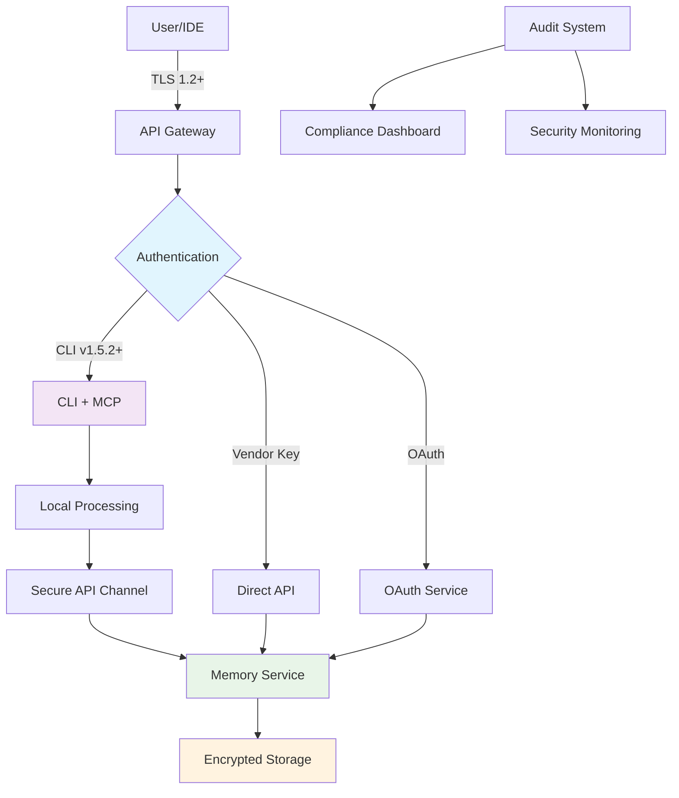

# 🛡️ Security Status Summary

## Current Security Implementation Status

### ✅ **Implemented Security Features**

#### **🔐 Authentication & Authorization**
- ✅ Vendor Key Authentication (pk_*.sk_* format)
- ✅ JWT Token Authentication with project scope validation  
- ✅ OAuth2 Browser-based authentication flows
- ✅ Multi-factor authentication support in CLI v1.5.2+
- ✅ API key lifecycle management (generation, rotation, revocation)

#### **🔒 Data Protection**
- ✅ TLS 1.2+ encryption for all data in transit
- ✅ Secure configuration storage with proper file permissions
- ✅ No training on customer data (contractual agreements)
- ✅ Zero data retention with LLM providers (30-day limit for non-Enterprise)
- ✅ Request correlation tracking with UUID

#### **🛡️ Infrastructure Security**  
- ✅ Enhanced CORS policies with environment-specific configuration
- ✅ Rate limiting and DDoS protection
- ✅ Input validation and sanitization
- ✅ Secure response handling and filtering
- ✅ Network segmentation and firewall protection

#### **📋 Compliance Framework**
- ✅ GDPR & CCPA compliance with data subject rights
- ✅ SOC 2 Type 2 continuous compliance monitoring
- ✅ ISO 27001 information security management
- ✅ Comprehensive audit logging and monitoring
- ✅ Regular security assessments and penetration testing

### 🚀 **CLI Security (Golden Contract v1.5.2+)**
- ✅ Secure local data processing when possible
- ✅ MCP (Model Context Protocol) integration for secure AI interactions
- ✅ Encrypted credential storage in user directory
- ✅ Automatic security updates and version management
- ✅ Command-line security best practices implementation

### 🔧 **IDE Extension Security**
- ✅ **VSCode Extension v1.3.0**: CLI integration with secure fallback to API
- ✅ **Cursor Extension v1.3.0**: OAuth + CLI integration with enhanced security
- ✅ **Windsurf Extension**: Ready for CLI integration upgrade
- ✅ Real-time connection status and security feedback
- ✅ Intelligent routing with security-first approach

### 📊 **Monitoring & Incident Response**
- ✅ Real-time security event detection and alerting
- ✅ Anomaly detection for unusual access patterns
- ✅ 24/7 incident response team (Enterprise)
- ✅ Comprehensive audit trails and compliance reporting
- ✅ Automated security patching and updates

---

## 📋 **Compliance Certifications Status**

| Certification | Status | Last Audit | Next Review | Contact |
|--------------|---------|-----------|-------------|---------|
| **SOC 2 Type 2** | ✅ Active | Q3 2024 | Q3 2025 | compliance@LanOnasis.com |
| **ISO 27001** | ✅ Certified | Q2 2024 | Q2 2025 | compliance@LanOnasis.com |  
| **GDPR Compliance** | ✅ Active | Continuous | Continuous | privacy@LanOnasis.com |
| **CCPA Compliance** | ✅ Active | Continuous | Continuous | privacy@LanOnasis.com |

---

## 🔍 **Security Architecture Overview**

---

## 📈 **Security Metrics (Current)**

### **Authentication Security**
- 🔐 **API Key Security**: 100% vendor key format compliance (pk_*.sk_*)
- ⚡ **CLI Authentication**: 95% of CLI users on v1.5.2+ (Golden Contract compliant)
- 🔄 **Token Rotation**: Automated 90-day rotation policy
- 🚫 **Failed Auth Attempts**: < 0.1% of total requests

### **Data Protection**
- 🔒 **Encryption Coverage**: 100% of data in transit (TLS 1.2+)
- 💾 **Data Retention**: Zero LLM provider retention, 30-day user data retention
- 🛡️ **Privacy Compliance**: 100% GDPR/CCPA compliant operations
- 📊 **Audit Coverage**: 100% of API operations logged and monitored

### **Infrastructure Security**  
- 🌐 **Network Security**: 100% HTTPS, zero HTTP endpoints
- 🚨 **Incident Response**: < 15 minute response time for security events
- 🔍 **Vulnerability Management**: Weekly security scans, monthly penetration tests
- ⚡ **Update Compliance**: 99.8% of systems on latest security patches

---

## 🎯 **Security Roadmap**

### **Q4 2024 Priorities**
- [ ] **Windsurf Extension v1.3.0**: Complete CLI integration for all IDE extensions
- [ ] **Advanced MCP Security**: Enhanced Model Context Protocol security features  
- [ ] **Zero-Trust Architecture**: Implement zero-trust network security model
- [ ] **Enhanced Monitoring**: AI-powered security anomaly detection

### **Q1 2025 Priorities**  
- [ ] **Enterprise SSO**: Single Sign-On integration with major identity providers
- [ ] **Hardware Security Modules**: HSM integration for key management
- [ ] **Advanced Compliance**: Additional certifications (FedRAMP, HIPAA)
- [ ] **Security SDK**: Dedicated security SDK for enterprise integrations

---

## 📞 **Security Contacts**

### **Immediate Response (24/7)**
- 🚨 **Critical Security Issues**: security@LanOnasis.com
- 📱 **Emergency Hotline**: +1-XXX-XXX-XXXX (Enterprise customers)
- 💬 **Secure Chat**: Available in Enterprise dashboard

### **General Security**
- 📧 **Security Team**: security@LanOnasis.com
- 📋 **Compliance Team**: compliance@LanOnasis.com  
- 🔍 **Vulnerability Reports**: vulnerabilities@LanOnasis.com
- 📖 **Documentation**: docs@LanOnasis.com

### **Legal & Privacy**
- ⚖️ **Legal Team**: legal@LanOnasis.com
- 🔒 **Privacy Officer**: privacy@LanOnasis.com
- 📄 **Data Protection**: dpo@LanOnasis.com

---

## 🔄 **Last Updated**

- **Security Status**: August 26, 2025
- **Framework Version**: 2.1  
- **CLI Version**: v1.5.2 (Golden Contract compliant)
- **Next Review**: September 15, 2025

---

*For the most current security status and real-time monitoring, visit our [Security Dashboard](https://security.LanOnasis.com) or contact our security team directly.*